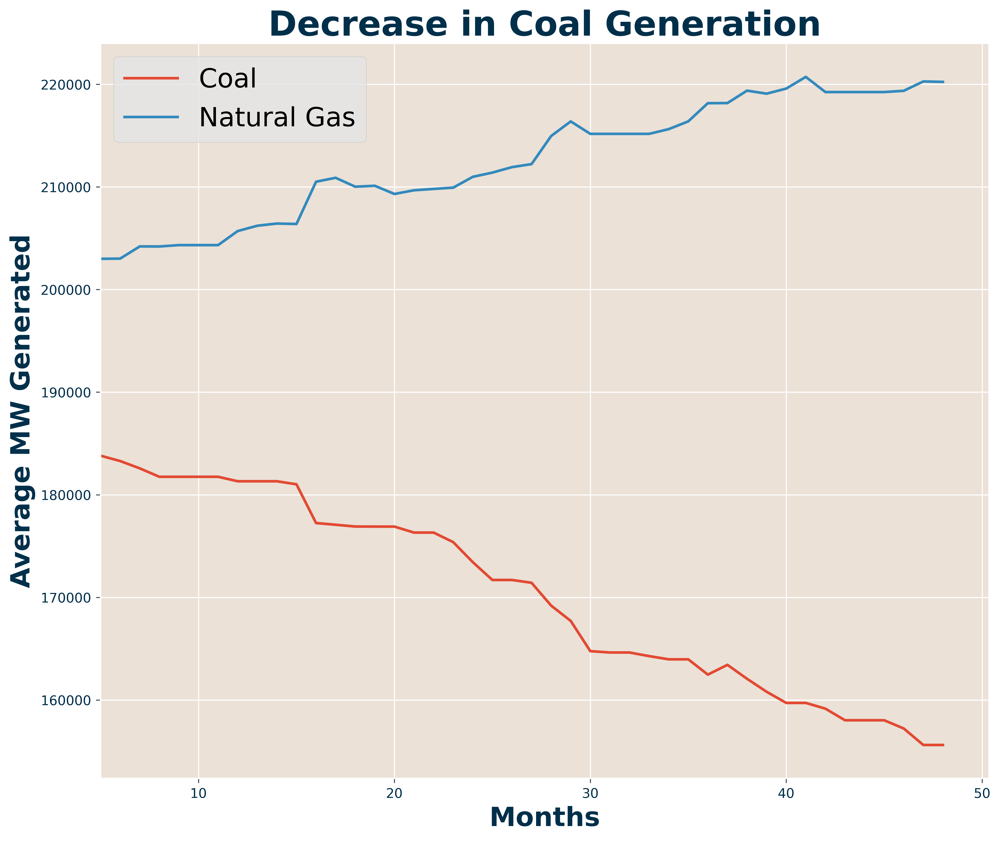
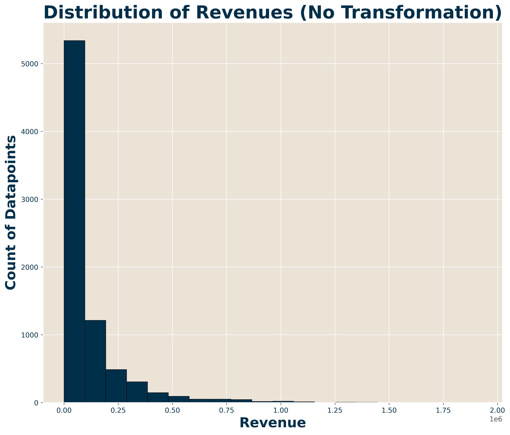

# Capstone 3

## Predicting US Energy Utility Revenues via Generation Portfolio Analysis
*Final Capstone Project for Galvanize Data Science Immersive*
 
*A Project by Luke Schroder*
## Learning Objectives
- Practice data pipelining from multiple, irregular sources
- Practice EDA
- Automate regression model selection and analysis
- Creating business recommendations from model analysis
## Table of Contents
- [Introduction](#Introduction)   
   - [Background and overview](#background-&-overview)
   - [The question](#the-question)
   - [Raw data](#raw-data)
   - [Data cleaning](#data-cleaning)
- [Exploratory Data Analysis](#Data-Cleaning-&-Exploratory-Data-Analysis)
   - [Top generation methods](#What-are-the-top-generation-methods)
   - [Addressing scaling](#Addressing-scaling)
- [Model Selection and Analysis](#Model-Selection-&-Analysis)
   - [Gradient boosted regression](#Gradient-Boosted-Regression)
   - [Important features](#Important-features)
- [Generation Portfolio Recommendations](#Generation-Portfolio-Recommendations)
  - [How to increase revenues](#How-to-increase-revenues)
- [Next steps](#next-steps)
 
# Introduction
## Background & overview:
Energy generation and sales in the United States is a complex and ever-changing industry. I wanted to create a project that demystifies a sample of the complex data from this industry while also providing insight into next steps energy utilities could take toward a cleaner future.
 
## The question:
**Can we shift toward a greener energy production future without sacrificing the bottom line?** Can we predict future utility revenues based on how much energy is generated by each type? 

## Raw data:
The data for this project is an aggregation of results from two yearly surveys of energy utilities conducted by The U.S. Energy Information Administration.

**EIA 860m:** This survey provides generator level data from multiple plants across different utilities in the United States including capacity and generation technologies by month from 2015-2020 *(Naming and reporting conventions vary year to year).*

**EIA 861m:** This survey contains Utility level data segmented into operational and sales data files by month from 2015-2020 *(Naming and reporting conventions vary year to year).*

## Data cleaning:
### Process flow:
The goal of this process was to aggregate the files into a dataset usable by machine learning algorithms.

The flow of this process is as follows:
| Process Step |                     Description                     |
|:------------:|:---------------------------------------------------:|
|       0       | Normalize naming conventions in features and data  |
|       1      |                Aggregate 860 by Month                |
|       2      | Join 861 Operational and Sales Data When Applicable |
|       3      |                Aggregate 861 by Month                |
|       4      |       Featurize 860, Groupby Utility and Year       |
| 5            | Join Aggregate 860 and 861 Datasets                 |

### Feature and data standardization:
The bulk of data cleansing took the form of standardizing the data across all years of survey results. A few examples of inconsistencies in the data are as follows:

- **Column names:** abbreviations/acronym changes
- **File types:** storage of the data in different file formats
- **Data encoding:** largely acronym changes
- **Reporting scale:** MWh and KWh scales were used
- **Sparse features:** many features were only reported for one or two years

### Feature Generation:
As mentioned above I took the EIA 860 generator level data and created new features for both the energy generation and percentage of portfolio by type for each utility. Along with generation portfolios I also split ownership types into encoded features (see below). These would later be one-hot encoded for model interpretability.
| Generation Type | Encoding |
|:---------------:|:--------:|
|       Coal      |     1    |
|   Natural Gas   |     2    |
|    Oil    |     3    |
| Hydroelectric   | 4        |
| Geothermal      | 5        |
| Wind            | 6        |
| Solar           | 7        |
| Nuclear         | 8        |
| Other         | 0        |

| Ownership Type | Encoding |
|:--------------:|:--------:|
|    Municipal   |     1    |
|   Cooperative  |     2    |
|     Retail Power Marketer    |     3    |
|      Other/Private     |     0    |

### Final product:

The Final dataset consisted of data for each utility by month by year with features outlining peak capacity (total, winter and summer), sales (in MWh), revenues, ownership type, percentage of generation from each type and MW generated at peak for each type.

# Additional Data Cleaning & Exploratory Data Analysis
## What are the top generation methods?

The graph above shows the amount generated in coal and natural gas for the past 5 years.

Here we can see that renewables are on the rise but at a much lower scale than the big two fossil fuels.
**A few notes:**
- Generation by coal has fallen in recent years
- Natural gas has steadily increased over time, likely do to the repurposing of coal/oil plants to natural gas
- As wind and solar technologies have improved we are seeing more generation in those categories

## Addressing scaling:
One thing to address before moving into the following section on my regression model: I absolute and log scaled revenues and many of the MW features to provide a more normal distribution. This **greatly increased** the predictive performance of my model.

**A few examples:**

# Model Selection & Analysis
## Gradient boosted regression:
*Check [here](./src/load_split) for model selection scripts**

To predict revenues per megawatthour sold I chose to use a cross-validated randomsearch followed by a cross-validated gridsearch method in sklearn. The randomsearch tested a large range of model hyperparameters and the gridsearch focused in on the smaller range generated. From there I chose the model with the lowest training RMSE score.

After testing several models I landed on **sklearn's GradientBoostedRegressor model** with the following hyperparameters:

|     Parameter    | Value |
|:----------------:|:-----:|
|   Learning Rate  |  0.2  |
|     Max Depth    |   9   |
| Min Samples Leaf |   15  |
|   Max Features   |  auto |
| # Estimators     | 150   |
| Max Leaf Nodes   | 8     |

This model produced very accurate predictions for revenues per MWh sold with **an RMSE score of 0.017 on unseen data.**

## Important features:
Earlier I mentioned the increasing amount of electricity generation by natural gas, solar and wind. These generation technologies did not have a large impact on the prediction one way or the other. The generation type with the highest impact on predicted revenue was nuclear.

**revenue boosting features include:**

- Municipal ownership
- Having at least one solar generator
- Having more than one type of generation

**Revenue per sale reducing features include:**

- Hydroelectric generation
- Having a high percentage of natural gas based generation
- Having a high percentage of oil based generation

# Generation Portfolio Recommendations
## How to increase revenues:

Going off the analysis provided in the section above my recommendations for energy utilities to increase revenue per sale are as follows:
- **Diversify generation portfolios:** high percentages of generation, specifically natural gas and oil reduce average revenue per MWh sold
- **Continue nuclear operations:** with many nuclear power plants scheduled to retire in the coming years it is paramount to keep these operational as they are some of the best factors in increasing revenue per sale. Investment in new nuclear generators could also be an option but initial costs would likely prevent returns for many years
